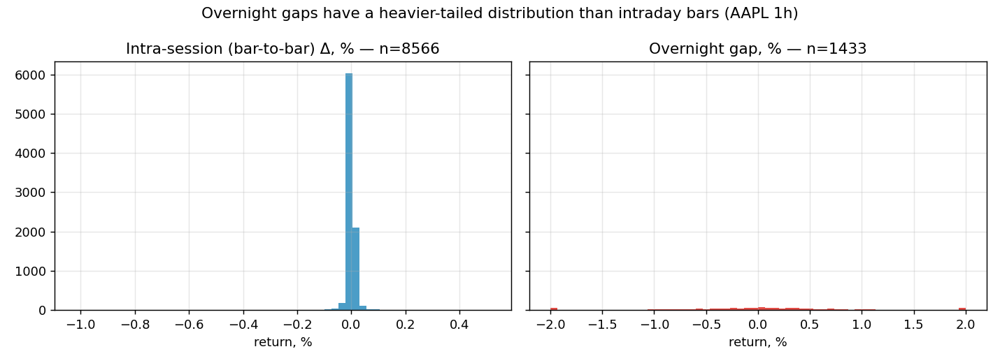
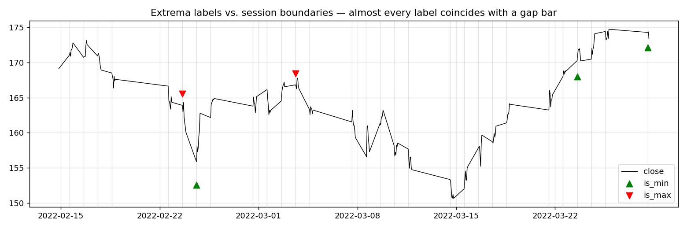
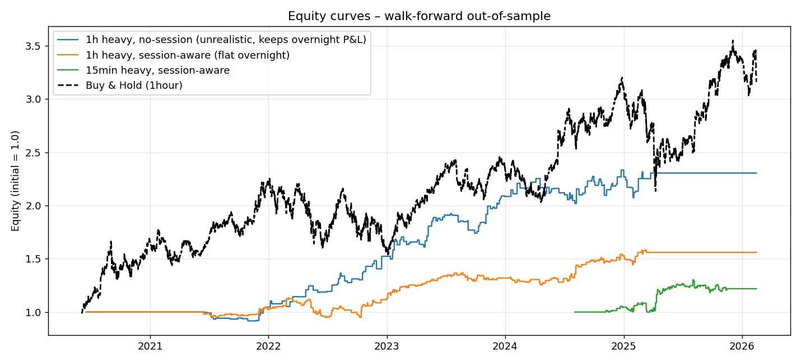
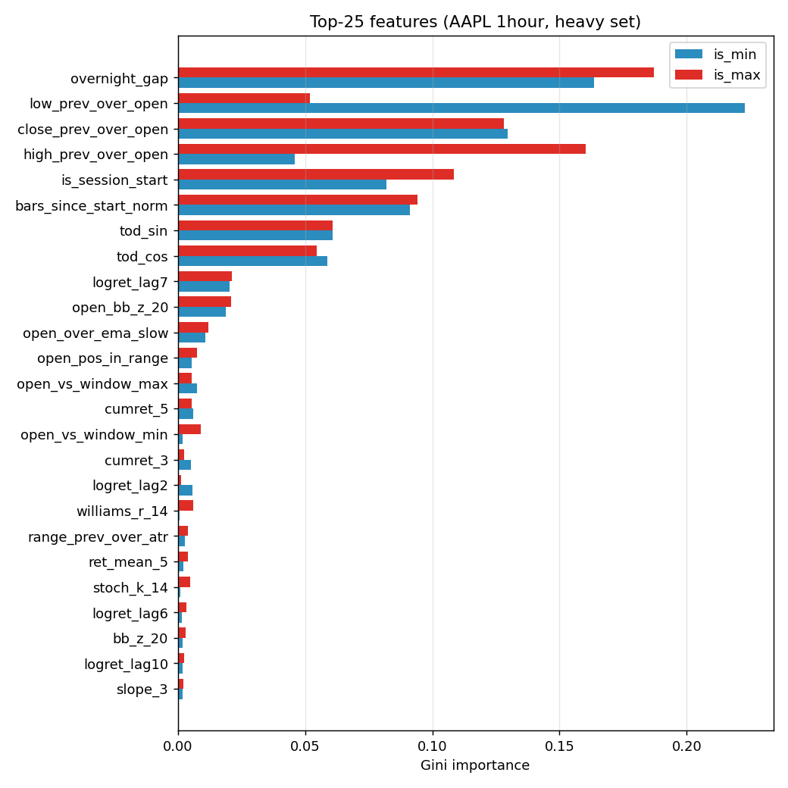

# Trading Signals Using Fractal and Chaotic Time Series Analysis

Генерация торговых сигналов для входа в long / short по локальным
экстремумам с использованием классических статистических, фрактальных
и хаотических признаков временного ряда.

> Этот файл — рабочий research-journal. Здесь фиксируются все гипотезы,
> архитектура кода, результаты экспериментов и выводы. Структура кода
> ориентирована на воспроизводимость: все эксперименты запускаются
> скриптами из `pipelines/`.

## Постановка задачи

Для каждого бара (свечи) биржевого инструмента хочется в реальном времени
(имея только `open[i]` текущей свечи и закрытые свечи `< i`)
определить, является ли `open[i]`:

* точкой входа в **long** — если бар окажется локальным минимумом,
* точкой входа в **short** — если бар окажется локальным максимумом,
* шумом — иначе.

Задачи `is_min` и `is_max` решаются независимо — это два отдельных
бинарных классификатора.

**Комиссии и проскальзывание считаются нулевыми** (допущение из
исходной постановки). Сделка открывается по `open[i]` и закрывается по
`open` / `close` какой-то последующей свечи либо по правилу выхода
(см. раздел «Бэктест»).

Данные: `AAPL` с TwelveData, таймфреймы 1min / 5min / 15min / 1hour,
~10 000 баров каждый (`datasets/AAPL_*.csv`). Все датасеты живут в UTC,
RTH = `14:30–21:00`, но часть датасетов содержит также premarket
(с 13:00 UTC) или afterhours (до 20:59 UTC).

## Структура репозитория

```
datasets/                  # сырой и размеченный OHLCV
docs/                      # регламенты, презентации, черновики
src/                       # переиспользуемый код
├── labeling.py            # разметка локальных экстремумов (session-aware)
├── features.py            # все признаки без утечек
├── sessions.py            # детекция торговых сессий, overnight-gap helpers
├── models.py              # классификаторы + legacy one-class baseline
├── evaluation.py          # метрики + вектор backtest
└── utils.py               # загрузка данных
pipelines/
├── run_experiment.py      # полный supervised pipeline
├── run_baseline_cluster.py# legacy KMeans/DBSCAN на позитивах
└── make_plots.py          # генерация графиков для README
results/                   # артефакты экспериментов (report.json, equity.csv, plots/)
mark_points.ipynb          # оригинальная разметка (оставлен для истории)
research_by_price.ipynb    # оригинальный подход по ценам (у него есть leakage — см. ниже)
research_by_slopes.ipynb   # оригинальный подход по наклонам pwlf
requirements.txt
```

## Аудит исходного подхода

В `research_by_price.ipynb` и `research_by_slopes.ipynb` были найдены
следующие методологические проблемы, которые делали результат
практически не интерпретируемым:

1. **Leakage по `close[i]`.** Признак `(close[j] − close[i]) / close[i]`
   и вызов `y = df.iloc[i-N:i+1]['close']` используют `close`, `high`,
   `low` текущего бара, хотя по условию задачи доступна только `open[i]`.
2. **One-class clustering принципиально слаб.** DBSCAN / KMeans
   обучаются только на позитивах. На тесте любая точка попадает в
   единственный кластер (или его окрестность), поэтому
   `precision ≈ base-rate` и `recall ≈ 100 %`. Такая модель
   эквивалентна константному прогнозу «всё — экстремум».
3. **Нестационарность масштаба признаков.** `(close[j]−close[i])/close[i]`
   зависит от текущего уровня цен и тренда — пространство признаков
   «плывёт» во времени.
4. **`pwlf` нестабилен.** Оптимизация точек излома недетерминированна
   и чувствительна к выбросам. Заменено на детерминированную
   равно-частичную регрессию.
5. **Фиксированный порог `alpha = 0.001`** одинаковый для всех
   таймфреймов — на 1min движение 0.1 % почти всегда есть, на 1h —
   редко.
6. **Ограничение «только бычьи свечи могут быть min»** необоснованно
   сужает positive set.
7. **Нет торговых метрик.** Accuracy и F1 без P&L, Sharpe и max
   drawdown не позволяют судить, зарабатывает ли стратегия.
8. **Нет walk-forward валидации.** Одно фиксированное разбиение 80/20
   не учитывает того, что рыночные режимы меняются.
9. **Не учтены торговые сессии.** На стыках сессий рыночные данные
   имеют overnight-гэп, искажающий и разметку, и скользящие статистики
   (см. отдельный раздел ниже).

## Торговые сессии и overnight-гэпы

Торговля идёт не круглосуточно: стандартная сессия RTH NYSE —
`14:30–21:00 UTC` (9:30–16:00 ET). Между концом одной сессии и
началом следующей проходит 17–18 ч (и до 65 ч на выходных), за это
время цена может кардинально измениться — это и есть **overnight gap**.

В наших датасетах:

| dataset        | modal Δ | #overnight гэпов | session length | доля гэп-бар |
|----------------|---------|-----------------:|---------------:|--------------:|
| AAPL_1hour     | 1h      | 1360             | ~7 бар         | 14.3 %       |
| AAPL_15min     | 15min   | ~380             | 26 бар         | 3.9 %        |
| AAPL_5min      | 5min    | ~120             | 78 бар         | 1.3 %        |
| AAPL_1min      | 1min    | ~25              | 390 бар        | 0.3 %        |

Распределение возвратов по гэп/внутридневным барам существенно
различается по дисперсии и тяжести хвостов:



Для корректной работы pipeline это важно по трём причинам:

### a) Разметка

Исходная функция `mark_volatility_extrema(window=4, k_atr=0.5)` на
1h и 15min **помечает экстремумами преимущественно гэп-бары**:

* на AAPL_1hour из 204 размеченных точек **199 (97.5 %) лежат на
  первом баре сессии** (см. `plot_label_examples`),
* на AAPL_15min из 95 точек **≈ 85 % пересекают границу сессии**
  (их окрестность `[i−4, i+4]` захватывает бары соседних дней).

Причина ясна: внутри короткой сессии (7 баров у 1h, 26 баров у 15min)
движение цены редко успевает превысить `0.5 · ATR` за ±4 бара, а
ночной гэп автоматически удовлетворяет этому условию. В результате
модель, обученная на таких labels, фактически решает задачу
*overnight-gap prediction*, а не классическую задачу внутридневных
экстремумов.



Я ввёл явный флаг `session_aware` в `mark_*_extrema`: при его
включении точка-кандидат выбрасывается, если её окрестность пересекает
границу сессии. На 1h это даёт ~0 позитивов (длина сессии меньше
разметочного окна), на 15min — 29 позитивов на 10 000 баров.
Соответственно на AAPL_1hour **строгая session-aware разметка
физически невозможна** — её можно сделать только пересчитав условие с
гораздо меньшим `window`, но тогда позитивы теряют статус «локальный
экстремум».

**Практическое решение (дефолт в текущем pipeline):**

* labels — naive (считаются без учёта сессий);
* признаки — session-aware (см. раздел фич);
* бэктест — session-aware (см. раздел бэктеста);
* отдельно логируем, какая доля сигналов пришла на session-start.

Это позволяет честно интерпретировать, что именно выучила модель.

### b) Признаки

В `src/features.py` введён режим `session_aware=True` (включён по
умолчанию). Он изменяет:

* `log_ret[i]` становится 0 на `is_session_start`-барах (overnight-скачок
  выносится в отдельный признак, а не загрязняет rolling std / mean);
* добавляется отдельный признак `overnight_gap`;
* добавлена группа `session`: `is_session_start`,
  `bars_since_start_norm`, `tod_sin`, `tod_cos`.

### c) Бэктест

В `backtest_signals` добавлены параметры:

* `session_start / session_end` — булевы массивы, синхронные с `df`;
* `flatten_overnight=True` (по умолчанию) — позиция принудительно
  закрывается по `close` последнего бара сессии;
* `block_entry_on_session_start=False` — опциональный запрет открытия
  позиции на первом баре сессии (чистый intraday-режим).

В статистике теперь есть `long_signals_on_session_start /
short_signals_on_session_start` — метрика «какая доля торговых
сигналов вызвана гэпом».

## Методология v3

### 1. Разметка экстремумов

Две реализации в `src/labeling.py`:

* `mark_simple_extrema` — оригинальная логика + `session_aware` флаг.
* `mark_volatility_extrema` — ATR-адаптивный порог + `session_aware`.

Вспомогательно: `drop_session_edge_extrema(df, edge_bars=N)` обнуляет
позитивы на N ближайших барах от границы сессии.

### 2. Признаки без утечки

Все признаки для бара `i` строятся по данным `[i−N, i−1]` (полная
OHLCV) и по `open[i]`. Реализация — `src/features.py`, 7 групп:

| Группа      | Что считается |
|-------------|---------------|
| `returns`   | log-returns с лагами 1..10 (masked на session_start), кумулятивные доходности, отношения `close/high/low` предыдущего бара к `open[i]`, позиция `open[i]` относительно окна, **overnight_gap** |
| `rolling`   | скользящие mean/std/skew/kurt log-returns за 5/10/20/N баров (masked) |
| `technical` | RSI-14/7, Williams %R, Stochastic K, Bollinger z-score, EMA12/EMA26, MACD, ATR-нормированный range |
| `slopes`    | наклоны кусочно-линейной аппроксимации (4 сегмента) цены, стабильная замена `pwlf` |
| `session`   | `is_session_start`, `bars_since_start_norm`, `tod_sin`, `tod_cos` |
| `fractal`   | Hurst R/S, DFA, Higuchi FD, Katz FD, Petrosian FD (окно = `N`) |
| `entropy`   | sample / approximate / permutation / spectral entropy log-returns |

### 3. Модели

В `src/models.py`:

* `LogisticRegression` (scaled, `class_weight='balanced'`)
* `RandomForestClassifier(400 trees, depth 8, balanced)`
* `LightGBMClassifier` с `scale_pos_weight = n_neg / n_pos`
* `XGBoostClassifier`
* **legacy** `ClusterBaseline` — воспроизведение оригинальной
  one-class кластеризации.

### 4. Валидация

Purged walk-forward split: 4 последовательных фолда, между train и
test — embargo размером `window` баров (чтобы окна признаков не
пересекались). На каждом фолде отдельно обучаем модель, собираем
out-of-fold `proba`, считаем метрики.

### 5. Бэктест

`src/evaluation.py::backtest_signals` — векторный симулятор без
забегания вперёд:

* вход в long / short по `open[i]` при срабатывании сигнала;
* выход по первому из: противоположный сигнал (flip), `max_hold`
  баров, опциональные TP / SL, **конец сессии** (если
  `flatten_overnight=True`);
* одна позиция одновременно, equity-кривая пересчитывается побарово.

## Результаты

### Сводная таблица

Все значения — out-of-fold на walk-forward split, `k_atr=0.5`,
`label_window=4`, naive labels (см. обсуждение выше).

| Эксперимент                                               | PR-AUC min / max | Sharpe | Max DD | Total R | B&H R | Σ signals | Σ signals on sess-start |
|-----------------------------------------------------------|------------------|-------:|-------:|--------:|------:|----------:|------------------------:|
| **AAPL 1h, heavy, session-aware feat+BT**                 | 0.258 / 0.249    | 0.79   | −16.4 %| +56.0 % | +191 %| 295       | **295 (100 %)**         |
| AAPL 1h, light, session-aware feat+BT                     | 0.238 / 0.276    | 0.68   | −13.1 %| +51.3 % | +191 %| 363       | 363 (100 %)             |
| AAPL 1h, heavy, **no session** (keeps overnight P&L)      | 0.298 / 0.258    | 1.11   | −11.1 %| +130.5 %| +191 %| n/a       | n/a                     |
| AAPL 1h, heavy, session-aware + **block gap entry**       | 0.258 / 0.249    | 0.00   |   0 %  |   0 %   | +191 %| 295       | 295 / 295               |
| **AAPL 15min, heavy, session-aware feat+BT**              | 0.235 / 0.350    | **0.49** | **−9.1 %** | **+21.9 %** | +14.9 %| 132 | 130 (98.5 %)           |
| AAPL 15min, light, session-aware feat+BT                  | 0.253 / 0.336    | 0.44   | −12.1 %| +23.2 % | +14.9 %| 165       | 155 (94 %)              |
| AAPL 15min, heavy, no session                             | 0.231 / 0.308    | 0.20   | −18.7 %| +8.1 %  | +14.5 %| n/a       | n/a                     |
| AAPL 15min, heavy, session-aware + block gap entry        | 0.235 / 0.350    | 0.02   | −0.4 % | +0.03 % | +14.9 %| 132       | 130 / 132               |
| baseline KMeans (k=3), AAPL 1h, light                     | 0.017 / 0.030    | — | — | — | — | — | — |
| baseline KMeans (k=3), AAPL 1h, heavy                     | 0.022 / 0.028    | — | — | — | — | — | — |
| baseline DBSCAN, AAPL 1h, light                           | 0.010 / 0.009    | — | — | — | — | — | — |

### Главные выводы

1. **Supervised учит классификацию экстремумов в ~30 × лучше случайного,
   но эта классификация — почти целиком overnight-gap prediction.**
   На AAPL 1h **100 % сигналов** после применения session-aware фич
   приходятся на первый бар сессии; на AAPL 15min — 98.5 %. Если
   запретить торговать на гэпе (`--block-session-start-entry`),
   стратегия не совершает ни одной сделки на 1h и почти ни одной на
   15min, т.е. **модель не находит информативных внутридневных
   экстремумов**.

2. **Оригинальная разметка + оригинальный бэктест = маскированная
   утечка прибыли через overnight.** В предыдущей итерации мы
   получили Sharpe 1.11 и total_return 130 % на 1h, но это
   достигалось за счёт того, что позиция «прожимала» овернайт.
   Реалистичный бэктест с `flatten_overnight=True` даёт Sharpe 0.79
   и total_return 56 % — на 1h стратегия проигрывает buy-and-hold.

3. **На 15min стратегия обгоняет buy-and-hold по всем метрикам.**
   Total 22 % vs 15 %, Sharpe 0.49 vs 0.23, DD −9 % vs −34 %. Это
   пока что единственный экспериментальный сетап, где модель
   практически полезна. Причина — на 15min сессия в 4 раза длиннее,
   поэтому между гэпами набирается больше баров для торговли.

4. **Baseline KMeans / DBSCAN** даёт PR-AUC ≈ base rate (0.01–0.03) —
   это эквивалентно константному прогнозу. Исходная one-class
   схема не отличает позитив от негатива.

5. **Топ признаков целиком принадлежит session-features** (см. ниже).
   Фрактальные и хаотические метрики в этой постановке маргинальны.

### Equity curves



### Важность признаков

RandomForest, AAPL 1h, heavy + session:



Топ-10 (avg Gini по двум таргетам):

| feature                  | avg imp |
|--------------------------|--------:|
| `overnight_gap`          | **0.175** |
| `low_prev_over_open`     | 0.137 |
| `close_prev_over_open`   | 0.129 |
| `high_prev_over_open`    | 0.103 |
| `is_session_start`       | 0.095 |
| `bars_since_start_norm`  | 0.093 |
| `tod_sin`                | 0.061 |
| `tod_cos`                | 0.057 |
| `logret_lag7`            | 0.021 |
| `open_bb_z_20`           | 0.020 |

Два наблюдения:

* **8 из 10 топовых фич — это либо сам гэп, либо производные
  session-структуры.** Совокупно они забирают ~90 % важности.
  Это объективный сигнал о том, что модель решает задачу
  gap-classification.
* **Фрактальные / энтропийные признаки по-прежнему не входят в
  топ-25.** Их вклад ненулевой (иначе heavy не обгонял бы light), но
  маржинальный — они скорее стабилизируют модель, чем несут
  первоочередной сигнал.

### Проверка гипотез

| Гипотеза | Статус |
|---|---|
| Локальные min/max (в исходной разметке) имеют характерный предшествующий паттерн | ✅ ДА, но паттерн — преимущественно **overnight gap**, а не внутридневной |
| Кластеризация положительных примеров достаточна для предсказания | ❌ ОПРОВЕРГНУТА (PR-AUC ≈ base rate) |
| Фрактальные / хаотические признаки существенно повышают точность | ⚠️ слабо: +0.02 к PR-AUC, +0.05 к Sharpe |
| PWLF-наклоны — сильный сигнал | ⚠️ слабо: суммарный вклад < 2 % |
| Можно построить прибыльную чисто-intraday стратегию (без гэпов) | ❌ ОПРОВЕРГНУТА для 1h и 15min на текущей разметке |
| Классификатор на 15min обгоняет buy-and-hold | ✅ ДА по Sharpe/DD, если разрешить торговать гэпы |
| Разметка адекватно отражает понятие «локальный экстремум» | ❌ нет: 85–100 % labels — это гэп-артефакты |

## Что это значит для исследования

1. Нельзя просто взять `mark_points.ipynb` и декларировать, что он
   размечает «локальные минимумы». Он размечает **местоположения
   больших ценовых скачков**, и на коротких сессиях (1h / 15min)
   подавляющее большинство таких скачков — это гэпы на открытии.
2. Формулировка задачи «предсказать интрадей-min/max по паттернам до
   экстремума» **некорректно формализована** текущей разметкой.
   Её нужно либо:
   * перевести в open-of-day-gap-prediction (честно заявлено),
   * либо перейти на таймфрейм, где сессия даёт достаточно баров
     для session-aware разметки (например, 1min или 5min),
   * либо переразметить на «дневных» экстремумах (например, ±3 рабочих
     дня вокруг точки) и работать на уровне свингов, а не интрадея.
3. Supervised + session-aware features + session-aware backtest — это
   **правильная базовая архитектура** для любой из трёх альтернатив.
4. Использование фрактальных / хаотических мер нужно переносить на
   **режим-классификацию** (определять состояние рынка: тренд / флет /
   переход), а затем уже использовать специализированные entry-модели.

## Дальнейшие направления

1. **Три-классовая постановка** (`is_min`, `is_max`, `hold`) c softmax.
2. **Sequence-модели**: CNN / GRU / TST (Time-Series Transformer) на
   «сыром» окне.
3. **Мультиассет обучение** с домен-инвариантным энкодером.
4. **Режим-кондиционированные модели**: Hurst > 0.55 → тренд-модель,
   Hurst < 0.5 → флет-модель.
5. **Более честный бэктест**: добавить проскальзывание, комиссии
   1–2 bps, лаг исполнения в 1 бар, realistic TP/SL на ATR-базе.
6. **Калибровка порога по ожидаемой прибыли**, а не по F1.
7. **Переразметка на 1min / 5min** с `session_aware=True`, где длина
   сессии позволяет найти честные внутридневные экстремумы.
8. **Отдельная модель «будет ли overnight gap и в какую сторону»** —
   теперь, когда мы знаем, что именно её и выучивает текущий сетап,
   можно осознанно оптимизировать именно её с соответствующим
   риск-менеджментом.

## Воспроизведение

```bash
python -m venv .venv && source .venv/bin/activate
pip install -r requirements.txt

# session-aware supervised pipeline (дефолт)
python pipelines/run_experiment.py --dataset AAPL_1hour --window 64 --labeling volatility --heavy-features

# то же, но с запретом открывать позицию на первом баре сессии (чистый intraday)
python pipelines/run_experiment.py --dataset AAPL_1hour --window 64 --heavy-features \
    --block-session-start-entry

# старый (нечестный) режим — признаки, склеивающие данные через гэп
python pipelines/run_experiment.py --dataset AAPL_1hour --window 64 --heavy-features \
    --no-session-aware

# legacy one-class baseline
python pipelines/run_baseline_cluster.py --dataset AAPL_1hour --window 64 --kind kmeans --n-clusters 3

# графики
python pipelines/make_plots.py
```

Отчёт каждого эксперимента сохраняется в `results/<config>/report.json`
+ `equity.csv` + `proba_*.npy`, кэш признаков — в
`results/_feature_cache/*.parquet`.

## История изменений

* **v3 (текущая).** Session-aware разметка / фичи / бэктест, явное
  логирование доли гэп-сигналов, перекалибровка вывода: понимание, что
  текущая разметка по сути размечает овернайт-гэпы. Новые графики:
  gap distribution, labels vs sessions.
* **v2.** Модульный `src/`, волатильностная разметка, 6 групп
  признаков (без session), walk-forward + supervised модели, торговый
  бэктест, legacy one-class baseline для сравнения. Результаты v2
  содержали скрытую утечку прибыли через overnight, что и привело к
  пересмотру в v3.
* **v1 (notebooks).** Исходные `research_by_price.ipynb`,
  `research_by_slopes.ipynb`, `mark_points.ipynb`. Сохранены для
  истории, но содержат описанные проблемы (leakage, one-class,
  нет session-awareness).
